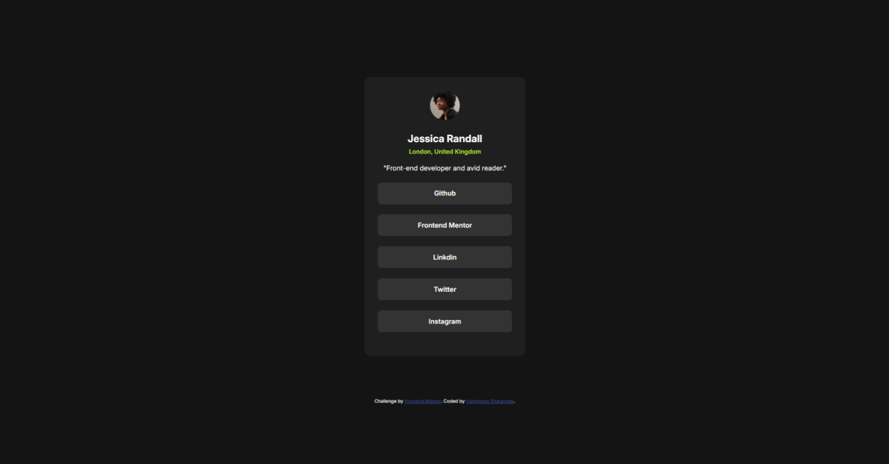

# Frontend Mentor - Social links profile solution

This is a solution to the [Social links profile challenge on Frontend Mentor](https://www.frontendmentor.io/challenges/social-links-profile-UG32l9m6dQ). Frontend Mentor challenges help you improve your coding skills by building realistic projects.

## Table of contents

- [Overview](#overview)
  - [The challenge](#the-challenge)
  - [Screenshot](#screenshot)
  - [Links](#links)
- [My process](#my-process)
  - [Built with](#built-with)
  - [What I learned](#what-i-learned)
  - [Continued development](#continued-development)
- [Author](#author)
- [Acknowledgments](#acknowledgments)

## Overview

### The challenge

Users should be able to:

- See hover and focus states for all interactive elements on the page

### Screenshot

### Links

- Solution URL: [https://github.com/uptowngirl757/social_links](https://github.com/uptowngirl757/social_links)
- Live Site URL: [https://uptowngirl757.github.io/social_links/](https://uptowngirl757.github.io/social_links/)

## My process

### Built with

- Semantic HTML5 markup
- CSS custom properties
- Flexbox

### What I learned

I tried not setting a height on my container. i actually saw this tip reading someone else's solution code on the QRcode challenge and I decided to try it. It worked! and it made my life way easier as I did'nt have to deal with overflow or anything like that in my page.

### Continued development

I would need to work on a deeper understanding of flexbox and how to use it right

## Author

- Frontend Mentor - [@uptowngirl757](https://www.frontendmentor.io/profile/uptowngirl757)

## Acknowledgments

Bradley Tim from the Frontend mentor. I read his CSS code on the QRcode component challenge and decided to try not setting a min-height. It was a good idea. Thanks!
